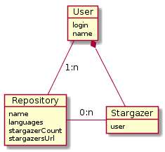

GitHub ist der Quasistandard für Open Source Programmierprojekte im Internet. _Git_ ist das darunterliegende Versionsverwaltungsystem und auch namensgebend für die Plattform. @mtsw In dieser Arbeit beschäftigen wir uns mit der GitHub Plattform, die Technologie Git liegt nicht in unserem Fokus.

## Datenmodell und Eigenschaften
Im GitHub steht primär der User mit einen Repositories (Quelltext-Datenbanken) im Zentrum. @wikipedia-github Wir kennen also nun mindestens zwei Entitäten und ihre Verknpüpfung zueinander; Es gibt User und diese können $0-n$ Repositories besitzen.

Wir beschränken uns auf ein sehr einfaches Modell da das für unser Vorhaben genügend ist. [Abbildung @fig:githubmodel] veranschulicht dieses Modell.

{#fig:githubmodel}

\newpage
\listoffigures
\listoftables

\newpage
Literaturverzeichnis
=====================
